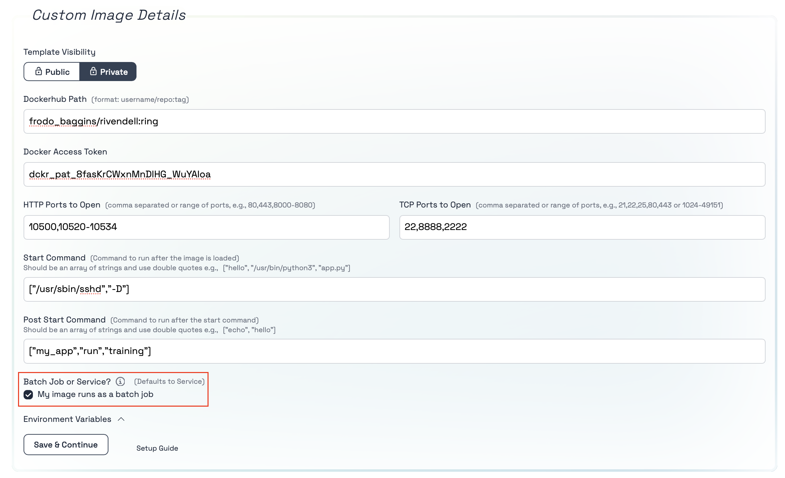

# How to run your own docker image on Tromero

## Initial configuration

Tromero provides various type of images that you can use to develop in. However, if you think these images do not fit your need then you have the option to bring your own image to our platform. 

To do this you have to navigate to the OS Template section of our page and select the __Custom Image__ button.


By choosing the __Custom Image__ option you will be presented with a various settings.


Here you can add the path to your docker image and the ports(TCP or HTTP) that you want to open for the container.


## How to access an image in a private repository

If you would like to access an image in your private repository you can click on the private button, it will open a field for your to enter your docker access token. 

To create a new __Access Token__ use [this](https://docs.docker.com/security/for-developers/access-tokens/) link.


## How to select ports for your container:

To open ports for your container you can enter your desired TCP or HTTP ports into their respective fields. If you would like to define a range/series of ports you can use "-" between the two end-ports of the series. This will include all the ports between the two end-ports including the ends-ports as well, e.g. 10520-10534 is all the port between 10520 and 10534 including those two ports too.


## How to define your Docker star command:


It is popular with docker containers to define a start-command that starts your application. If you did not define one in your container or you would like to overwrite it, you can define your custom start-command in the __Start Command__ field. Similarly to Docker containers, we require you to define your Docker start-command as an array of string separated by commas, e.g. ["/usr/sbin/sshd", "-D"] . __Important__ : this start-command overwrites the one defined in your Docker file so make sure that is what you want to and the command is correct before you use it.


## Add your post start command:

If you would like to execute other commands or setups after your Docker start command, for example you are using a public image which you do not know the Docker start command of and want to start a server after the container has started, then you can use the post-start command. This command is executed in the command line right after your container started and executed its Docker start-command. 


## How to have ssh access to your instance

To be able to ssh into your instance you will need to have an ssh server set up in your docker image on port 22 (or your specified port) with your chosen ssh key(s) present in your authorized keys folder.

If you do not know how to do this here is a template of an image that sets up ans ssh server on port 22 and copies your public ssh key from your chosen directory into your 

```docker
FROM [INSERT YOUR BASE IMAGE HERE]

# Update the package repository and install openssh-server
RUN apt-get update && apt-get install -y openssh-server

# Create the directory for the SSH daemon to run
RUN mkdir /var/run/sshd


# Copy your public key from the build context to the image
# Replace /path/to/your/public_key with the actual path in your build context
COPY /path/to/your/public_key /tmp/id_rsa.pub

# Create SSH directory for the root user
RUN mkdir -p /root/.ssh && \
    cat /tmp/id_rsa.pub >> /root/.ssh/authorized_keys && \
    chmod 600 /root/.ssh/authorized_keys && \
    rm /tmp/id_rsa.pub

# Expose port 22 to the outside world
# it is just documentation
EXPOSE 22

# Start the SSH service
# you can add the start command here too 
CMD ["/usr/sbin/sshd", "-D"] 

```


If the mentioned things above are all set up, then you just have add port 22 (or your specified port) to the TCP ports.


## How to add enviornment variables

If you would like to add enviornment variables to your instance you can click on the "Enviornment Variables" drop down menu where you can define the keys(variable names) and values that you would like to add as enviornment variables.


## Run your container as a batch job

If your container is not meant to serve requests and it is created for executing a job where the container calculates or executes a batch job based on some specification, but it does not actively interact with the the outside world, then you can select "My image runs as a batch job" option. This will not create an associated service or port mapping for your container, it simply runs the container until it completes its tasks.





Once you are satisfied with your set up you can click on "Continue" to select one of our many GPU options for your work. 

__Happy coding!__