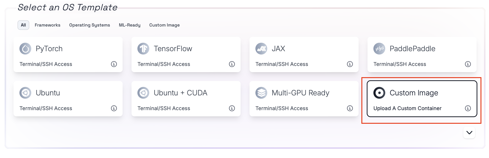
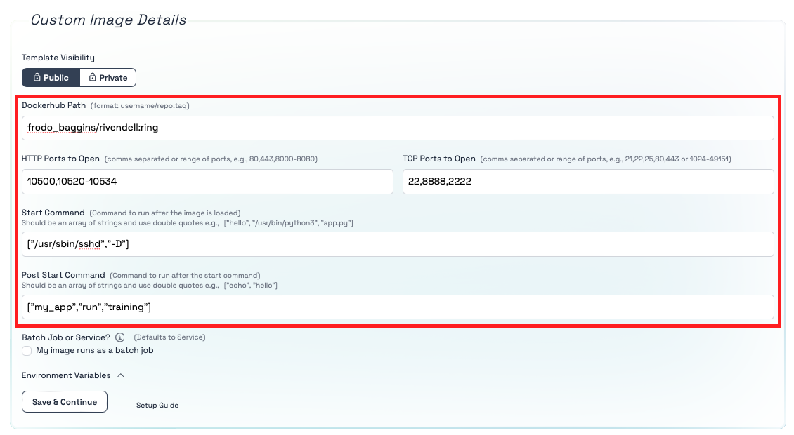

# How to run your own docker image on Tromero

## Initial configuration

Tromero provides various type of images that you can use to develop in. However, if you think these images do not fit your need then you have the option to bring your own image to our platform. 

To do this you have to navigate to the OS Template section of our page and select the __Custom Image__ button.



By choosing the __Custom Image__ option you will be presented with a various settings.



Here you can add the path to your docker image and the ports(TCP or HTTP) that you want to open for the container. If you would like a range of ports too be open you can use "-" sign to define a range, e.g. 10520-10534 is all the port between 10520 and 10534 including those two ports too.


## How to access an image in a private repository

If you would like to access an image in your private repository you can click on the private button, it will open a field for your to enter your docker access token. 

To createa new __Access Token__ use [this](https://docs.docker.com/security/for-developers/access-tokens/) link.


## How to have ssh access to your instance

To be able to ssh into your instance you will need to have an ssh server set up in your docker image on port 22 with your chosen ssh key(s) present in your authorized keys folder.

If you do not know how to do this here is a template of an image that sets up ans ssh server on port 22 and copies your public ssh key from your chosen directory into your 

```docker
FROM [INSERT YOUR BASE IMAGE HERE]

# Update the package repository and install openssh-server
RUN apt-get update && apt-get install -y openssh-server

# Create the directory for the SSH daemon to run
RUN mkdir /var/run/sshd


# Copy your public key from the build context to the image
# Replace /path/to/your/public_key with the actual path in your build context
COPY /path/to/your/public_key /tmp/id_rsa.pub

# Create SSH directory for the root user
RUN mkdir -p /root/.ssh && \
    cat /tmp/id_rsa.pub >> /root/.ssh/authorized_keys && \
    chmod 600 /root/.ssh/authorized_keys && \
    rm /tmp/id_rsa.pub

# Expose port 22 to the outside world
EXPOSE 22

# Start the SSH service
CMD ["/usr/sbin/sshd", "-D"]

```


If the mentioned things above are all set up, then you just have to click the SSH ACCESS button and add port 22 to the TCP ports.


__IMPORTANT!__ If you do not select these options then your image will be run as a batch job, meaning you will not be able to access it and will be completed once the apllication terminates. However, if you do not want to interact with you image andjust want it to execute a job then you can do that too by not selecting these options.

## How to add enviornment variables

If you would like to add enviornment variables to your instance you can click on the "Enviornment Variables" drop down menu where you can define the keys(variable names) and values that you would like to add as enviornment variables.


Once you are satisfied with your set up you can click on "Continue" to select one of our many GPU options for your work. 

__Happy coding!__